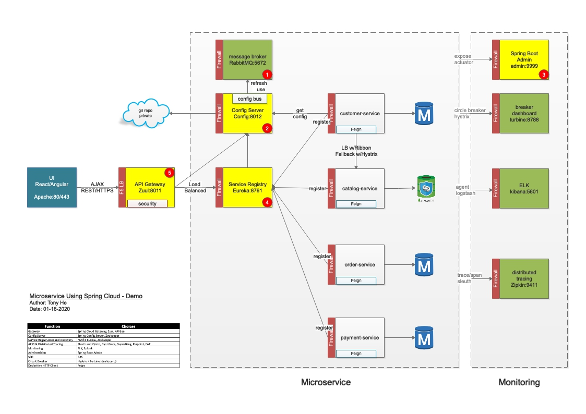

# iStore - Microservice Using Spring Cloud - Demo 

## IDE - Idea or Eclipse
You can directly run these services from IDE as a spring applicaiton.

## Maven
You can run each service in following command.
mvn spring-boot:run

## Docker

### 1. RabbitMQ - Message Broker (172.17.0.2)
docker run -d --name rabbitmq-management -p 15672:15672 -p 5672:5672 -p 15671:15671 -p 5671:5671 -p 4369:4369 rabbitmq:3-management

### 2. Config Server (172.17.0.3)
docker run -d --name config-server -e "spring.rabbitmq.host=172.17.0.2" -p 8012:8012 tonyhe2k/config-server

### 3. Spring Boot Admin (172.17.0.5)
docker run -d --name boot-admin -p 9999:9999 tonyhe2k/boot-admin

### 4. Eureka - Service Registry/Discovery (172.17.0.4)
docker run -d --name eureka-server -e "spring.cloud.config.uri=http://172.17.0.3:8012" -p 8761:8761 tonyhe2k/eureka-server

### 5. Zuul - API Gateway (172.17.0.6)
docker run -d --name api-gateway -e "spring.cloud.config.uri=http://172.17.0.3:8012" -p 8011:8011 tonyhe2k/api-gateway

### 6. Zipkin (172.17.0.7)
docker run -d --name zipkin-server -p 9411:9411 openzipkin/zipkin

### 7. MySQL (172.17.0.9)
docker run -d -p 3306:3306 --name mysql-server -e MYSQL_ROOT_PASSWORD=mysecret -e MYSQL_DATABASE=istore-user -e MYSQL_USER=webapp -e MYSQL_PASSWORD=pa$$abc mysql:latest

### Microservice - Catalog
docker run -d --name customer-service -e "spring.cloud.config.uri=http://172.17.0.3:8012" tonyhe2k/customer-service

### Microservice - Catalog
docker run -d --name catalog-service -e "spring.cloud.config.uri=http://172.17.0.3:8012" tonyhe2k/catalog-service

### Microservice - Order
docker run -d --name order-service -e "spring.cloud.config.uri=http://172.17.0.3:8012" tonyhe2k/order-service

